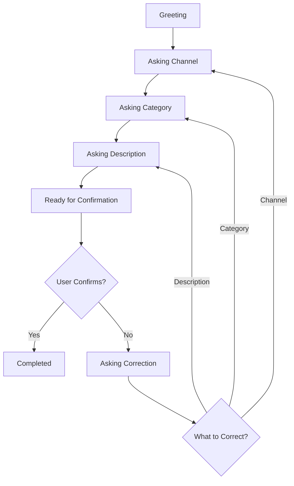

# Development Guide

## 🎯 Overview
Panduan lengkap untuk pengembangan Bank Customer Service Chatbot, mencakup arsitektur kode, patterns yang digunakan, dan best practices.

## 🏗️ Project Architecture

### 📂 Directory Structure Explained
```
chatbot/
├── 📁 public/                    # Frontend static files
│   ├── chatbot.html             # Main chat interface
│   ├── index.html               # Landing page  
│   ├── socket-test.html         # WebSocket testing page
│   └── socket-ts-test.html      # TypeScript socket test
├── 📁 src/                      # Backend source code
│   ├── 📁 config/
│   │   └── config.js            # Application configuration
│   ├── 📁 routes/
│   │   └── routes.js            # Express route definitions
│   ├── 📁 services/             # Business logic layer
│   │   ├── chat-processor.js    # Main chat flow orchestration
│   │   ├── chat-service.js      # Core chat utilities & session management
│   │   ├── faq-service.js       # FAQ handling logic
│   │   ├── lm-studio.js         # LM Studio API integration
│   │   └── sla-service.js       # SLA processing logic
│   └── 📁 utils/                # Helper utilities
│       ├── classification.js    # Data classification & autocorrect
│       ├── network-config.js    # Network configuration helpers
│       └── prompts.js           # AI prompt templates
├── 📁 data/                     # Data files
│   └── data_sheet_sla_extracted.csv
├── 📁 realtime/                 # WebSocket implementation
│   └── socket.ts                # TypeScript socket server
├── 📁 server/                   # Alternative server setup
│   ├── index.js                 # Socket.IO server implementation
│   └── package.json             # Server-specific dependencies
├── 📁 docs/                     # Documentation
│   ├── API.md                   # API documentation
│   ├── DEPLOYMENT.md            # Deployment guide
│   └── DEVELOPMENT.md           # This file
├── channel_category.json        # Channel & category configuration
├── server.js                    # Main Express server entry point
├── package.json                 # Project dependencies & scripts
└── README.md                    # Project overview
```

---

## 🔧 Core Components

### 1. Chat Processor (`chat-processor.js`)
**Purpose**: Orchestrates the entire chat flow and handles complex conversation logic.

**Key Responsibilities**:
- Message routing and state management
- One-shot information extraction
- Correction flow handling
- Confirmation logic
- Session lifecycle management

**Main Functions**:
```javascript
// Primary entry point for all chat interactions
async function processChatMessage(sessionId, userMessage)

// Detects if message contains comprehensive information for one-shot extraction
function detectCompleteInformation(message)

// Processes message using LM Studio extraction
async function processWithExtract(message)
```

**Architecture Pattern**: State Machine
```javascript
// Chat flow states
const CHAT_STATES = {
  GREETING: 'greeting',
  ASKING_CHANNEL: 'asking_channel', 
  ASKING_CATEGORY: 'asking_category',
  ASKING_DESCRIPTION: 'asking_description',
  READY_FOR_CONFIRMATION: 'ready_for_confirmation',
  ASKING_CORRECTION: 'asking_correction',
  COMPLETED: 'completed'
};
```

### 2. Chat Service (`chat-service.js`)
**Purpose**: Provides core chat utilities and session management.

**Key Responsibilities**:
- Session storage and retrieval
- Information extraction patterns
- Template response generation
- Confidence scoring
- Suggestion generation

**Session Management**:
```javascript
// In-memory session storage (production should use Redis)
const CHAT_SESSIONS = new Map();

// Session structure
const session = {
  id: 'uuid',
  messages: [],           // Conversation history
  collected_info: {},     // Extracted information
  current_step: 'greeting',
  needs_confirmation: false,
  is_complete: false,
  created_at: Date,
  last_activity: Date
};
```

### 3. LM Studio Integration (`lm-studio.js`)
**Purpose**: Handles AI model communication for natural language processing.

**Key Functions**:
```javascript
// Extract structured information from conversation
async function extractInfoFromConversation(messages)

// Extract JSON data using LLM
async function extractJsonWithLM(text)

// Generate description summary
async function generateDescriptionSummary(messages, collectedInfo)
```

**API Integration Pattern**:
```javascript
const LM_STUDIO_CONFIG = {
  baseURL: 'http://localhost:1234/v1',
  model: 'llama-3.1-8b-instruct',
  temperature: 0.1,
  max_tokens: 500
};
```

---

## 🔄 Chat Flow Logic

### 1. Message Processing Pipeline
```
User Message → Session Check → State Determination → Information Extraction → Response Generation → State Update
```

### 2. State Transitions


### 3. Information Extraction Strategies

#### Simple Pattern Matching
```javascript
function extractInfoSimple(message, currentAction) {
  const lowerMsg = message.toLowerCase();
  
  // Channel detection
  if (currentAction === 'asking_channel') {
    const channelMap = {
      'mobile banking': 'MBANK',
      'internet banking': 'IBANK', 
      'atm': 'ATM',
      'call center': 'CRM'
    };
    
    for (const [key, value] of Object.entries(channelMap)) {
      if (lowerMsg.includes(key)) {
        return { channel: value };
      }
    }
  }
  
  return {};
}
```

#### LM Studio Extraction
```javascript
async function extractWithLM(conversationHistory) {
  const prompt = `
Extract the following information from this banking customer conversation:
- Channel/Platform (ATM, MBANK, IBANK, etc.)
- Category (TRANSFER, PEMBAYARAN, TOP UP, etc.) 
- Description (detailed problem description)

Conversation:
${conversationHistory}

Return JSON only:
  `;
  
  const response = await callLMStudio(prompt);
  return JSON.parse(response);
}
```

---

## 🎨 Frontend Architecture

### HTML Structure
```html
<div class="chat-container">
  <div class="status-bar">          <!-- Session info & status -->
  <div class="chat-messages">       <!-- Message history -->
  <div class="typing-indicator">    <!-- Bot typing indicator -->
  <div class="chat-input-area">     <!-- User input form -->
</div>
```

### JavaScript Class Structure
```javascript
class ChatBot {
  constructor() {
    this.baseUrl = this.detectBaseUrl();
    this.sessionId = null;
    this.isTyping = false;
  }
  
  // Core methods
  async sendMessage(message, isInitial = false)
  addMessage(type, content, suggestions = [], data = null)
  updateStatus(data)
  setTyping(isTyping)
}
```

### CSS Architecture
```css
:root {
  /* Design system variables */
  --bg: #0f172a;
  --card: #111827;
  --ink: #e5e7eb;
  --accent: #38bdf8;
}

/* Component-based styles */
.message { /* Base message styles */ }
.message.user { /* User-specific styles */ }
.message.bot { /* Bot-specific styles */ }
.suggestion-btn { /* Interactive elements */ }
```

---

## 🔧 Configuration Management

### Environment Configuration
```javascript
// src/config/config.js
const config = {
  development: {
    port: process.env.PORT || 3000,
    lmStudioUrl: process.env.LM_STUDIO_URL || 'http://localhost:1234',
    logLevel: 'debug',
    sessionTimeout: 30 * 60 * 1000, // 30 minutes
    maxSessions: 100
  },
  production: {
    port: process.env.PORT || 8080,
    lmStudioUrl: process.env.LM_STUDIO_URL,
    logLevel: 'info', 
    sessionTimeout: 60 * 60 * 1000, // 1 hour
    maxSessions: 1000
  }
};

module.exports = config[process.env.NODE_ENV || 'development'];
```

### Dynamic Channel/Category Loading
```javascript
// Load from external JSON file
const channelCategoryConfig = require('../channel_category.json');

function loadChannelOptions() {
  return channelCategoryConfig.channels || [
    'ATM', 'IBANK', 'MBANK', 'CRM'
  ];
}

function loadCategoryOptions() {
  return channelCategoryConfig.categories || [
    'PEMBAYARAN', 'TRANSFER', 'TOP UP'
  ];
}
```

---

## 🧪 Testing Strategy

### Unit Tests
```javascript
// tests/chat-service.test.js
const { extractInfoSimple, computeConfidence } = require('../src/services/chat-service');

describe('Chat Service', () => {
  test('should extract channel from message', () => {
    const result = extractInfoSimple('mobile banking bermasalah', 'asking_channel');
    expect(result.channel).toBe('MBANK');
  });
  
  test('should compute confidence correctly', () => {
    const info = { channel: 'ATM', category: 'TRANSFER', description: 'Test' };
    const confidence = computeConfidence(info);
    expect(confidence).toBe(1.0);
  });
});
```

### Integration Tests
```javascript
// tests/chat-flow.test.js
const request = require('supertest');
const app = require('../server');

describe('Chat Flow Integration', () => {
  test('should handle complete conversation flow', async () => {
    // Step 1: Start conversation
    let response = await request(app)
      .post('/chat')
      .send({ message: 'Halo' });
    
    expect(response.body.action).toBe('asking_channel');
    const sessionId = response.body.session_id;
    
    // Step 2: Provide channel
    response = await request(app)
      .post('/chat')
      .send({ message: 'Mobile Banking', session_id: sessionId });
    
    expect(response.body.action).toBe('asking_category');
    expect(response.body.collected_info.channel).toBe('MBANK');
    
    // Continue flow...
  });
});
```

### End-to-End Tests
```javascript
// tests/e2e/chatbot.spec.js (Playwright/Puppeteer)
test('complete chat interaction', async ({ page }) => {
  await page.goto('http://localhost:3000/chatbot.html');
  
  // Wait for initial message
  await page.waitForSelector('.message.bot');
  
  // Type and send message
  await page.fill('#chatInput', 'Halo, ada masalah dengan mobile banking');
  await page.click('#sendBtn');
  
  // Check bot response
  await page.waitForSelector('.message.bot:nth-child(2)');
  const botMessage = await page.textContent('.message.bot:nth-child(2) .message-content');
  expect(botMessage).toContain('channel');
});
```

---

## 🔍 Debugging & Development Tools

### Logging Setup
```javascript
// utils/logger.js
const winston = require('winston');

const logger = winston.createLogger({
  level: process.env.LOG_LEVEL || 'info',
  format: winston.format.combine(
    winston.format.timestamp(),
    winston.format.colorize(),
    winston.format.printf(({ timestamp, level, message, ...meta }) => {
      return `${timestamp} [${level}]: ${message} ${Object.keys(meta).length ? JSON.stringify(meta, null, 2) : ''}`;
    })
  ),
  transports: [
    new winston.transports.Console(),
    new winston.transports.File({ filename: 'logs/app.log' })
  ]
});

module.exports = logger;
```

### Debug Helpers
```javascript
// Debug session state
function debugSession(sessionId) {
  const session = CHAT_SESSIONS.get(sessionId);
  console.log('📊 Session Debug:', {
    id: sessionId,
    messages: session.messages.length,
    current_step: session.current_step,
    collected_info: session.collected_info,
    confidence: computeConfidence(session.collected_info)
  });
}

// Debug extraction results
function debugExtraction(original, extracted, method) {
  console.log('🔍 Extraction Debug:', {
    method,
    original: original.substring(0, 100),
    extracted,
    success: Object.keys(extracted).length > 0
  });
}
```

### Development Middleware
```javascript
// Development-only debugging middleware
if (process.env.NODE_ENV === 'development') {
  app.use('/debug/sessions', (req, res) => {
    const sessions = Array.from(CHAT_SESSIONS.entries()).map(([id, session]) => ({
      id,
      message_count: session.messages.length,
      current_step: session.current_step,
      is_complete: session.is_complete
    }));
    
    res.json({ total: sessions.length, sessions });
  });
}
```

---

## 🚀 Performance Optimization

### Session Management
```javascript
// Session cleanup job
setInterval(() => {
  const now = Date.now();
  const timeout = 30 * 60 * 1000; // 30 minutes
  
  for (const [sessionId, session] of CHAT_SESSIONS.entries()) {
    if (now - session.last_activity > timeout) {
      CHAT_SESSIONS.delete(sessionId);
      console.log(`🗑️ Cleaned up inactive session: ${sessionId}`);
    }
  }
}, 5 * 60 * 1000); // Run every 5 minutes
```

### Response Caching
```javascript
const NodeCache = require('node-cache');
const responseCache = new NodeCache({ stdTTL: 600 }); // 10 minutes

function getCachedResponse(key) {
  return responseCache.get(key);
}

function setCachedResponse(key, value) {
  responseCache.set(key, value);
}
```

### LM Studio Connection Pooling
```javascript
// Connection pool for LM Studio
class LMStudioPool {
  constructor(maxConnections = 5) {
    this.maxConnections = maxConnections;
    this.activeConnections = 0;
    this.queue = [];
  }
  
  async acquire() {
    if (this.activeConnections < this.maxConnections) {
      this.activeConnections++;
      return new LMStudioConnection();
    }
    
    return new Promise((resolve) => {
      this.queue.push(resolve);
    });
  }
  
  release() {
    this.activeConnections--;
    if (this.queue.length > 0) {
      const resolve = this.queue.shift();
      this.activeConnections++;
      resolve(new LMStudioConnection());
    }
  }
}
```

---

## 🔧 Development Workflow

### Git Workflow
```bash
# Feature development
git checkout -b feature/new-channel-support
git add .
git commit -m "feat: add support for new banking channels"
git push origin feature/new-channel-support

# Create PR and merge to main
# Deploy to staging for testing
# Deploy to production after approval
```

### Code Standards
```javascript
// ESLint configuration (.eslintrc.js)
module.exports = {
  extends: ['eslint:recommended', 'node'],
  env: {
    node: true,
    es2021: true
  },
  rules: {
    'no-console': 'warn',
    'no-unused-vars': 'error',
    'prefer-const': 'error',
    'no-var': 'error'
  }
};
```

### Pre-commit Hooks
```json
// package.json
{
  "husky": {
    "hooks": {
      "pre-commit": "lint-staged"
    }
  },
  "lint-staged": {
    "*.js": ["eslint --fix", "prettier --write"],
    "*.html": ["prettier --write"],
    "*.css": ["prettier --write"]
  }
}
```

---

## 📝 Code Patterns & Best Practices

### Error Handling Pattern
```javascript
// Consistent error handling
async function safeExecute(operation, fallback) {
  try {
    return await operation();
  } catch (error) {
    console.error('Operation failed:', error);
    return fallback;
  }
}

// Usage
const result = await safeExecute(
  () => extractJsonWithLM(message),
  { channel: null, category: null, description: null }
);
```

### Configuration Pattern
```javascript
// Environment-aware configuration
const getConfig = (key, defaultValue) => {
  const value = process.env[key] || defaultValue;
  if (key.includes('PORT')) return parseInt(value);
  if (key.includes('TIMEOUT')) return parseInt(value);
  return value;
};
```

### Response Template Pattern
```javascript
// Consistent API responses
function createApiResponse(data, status = 'success', message = null) {
  return {
    status,
    message,
    data,
    timestamp: new Date().toISOString()
  };
}
```

---

## 🎯 Adding New Features

### 1. Adding New Channel Support
```javascript
// 1. Update channel_category.json
{
  "channels": [...existing, "NEW_CHANNEL"]
}

// 2. Add pattern matching in chat-service.js
const channelPatterns = {
  ...existing,
  'new channel keyword': 'NEW_CHANNEL'
};

// 3. Update validation in validatePayload()
const validChannels = [...existing, 'NEW_CHANNEL'];
```

### 2. Adding New Extraction Method
```javascript
// 1. Create new extraction function
async function extractWithNewMethod(message) {
  // Implementation
  return extractedData;
}

// 2. Update processChatMessage to use new method
if (shouldUseNewMethod(message)) {
  extractedInfo = await extractWithNewMethod(message);
} else {
  // Fallback to existing methods
}
```

### 3. Adding New Chat State
```javascript
// 1. Define new state
const NEW_STATE = 'asking_new_info';

// 2. Add to determineChatAction()
function determineChatAction(collectedInfo, messageCount) {
  if (needsNewInfo(collectedInfo)) {
    return NEW_STATE;
  }
  // ... existing logic
}

// 3. Handle in processChatMessage()
if (action === NEW_STATE) {
  // Handle new state logic
}
```

---

## 🔍 Monitoring & Analytics

### Performance Metrics
```javascript
// Track response times
const responseTimeMetrics = new Map();

function trackResponseTime(operation, startTime) {
  const duration = Date.now() - startTime;
  if (!responseTimeMetrics.has(operation)) {
    responseTimeMetrics.set(operation, []);
  }
  responseTimeMetrics.get(operation).push(duration);
}
```

### Business Metrics
```javascript
// Track conversation completion rates
const conversationMetrics = {
  started: 0,
  completed: 0,
  abandoned: 0,
  correction_requested: 0
};

function updateMetrics(event, sessionData) {
  conversationMetrics[event]++;
  // Send to analytics service
}
```

---

## 📚 Additional Resources

### Documentation Links
- [Express.js Documentation](https://expressjs.com/)
- [Socket.IO Documentation](https://socket.io/docs/v4/)
- [LM Studio API Reference](https://lmstudio.ai/docs)

### Useful Tools
- **Postman**: API testing (collection included)
- **VS Code**: Development environment
- **Chrome DevTools**: Frontend debugging
- **Node Inspector**: Backend debugging

### Learning Resources
- [Node.js Best Practices](https://github.com/goldbergyoni/nodebestpractices)
- [JavaScript Patterns](https://addyosmani.com/resources/essentialjsdesignpatterns/)
- [RESTful API Design](https://restfulapi.net/)

---

**Last Updated**: August 2025  
**Version**: 1.0.0
